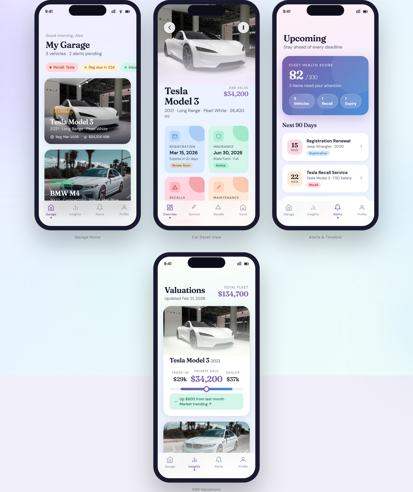
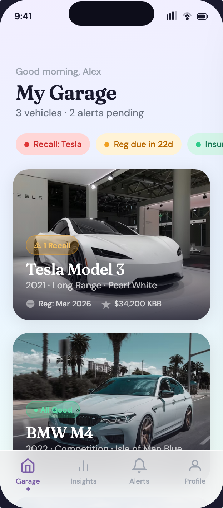
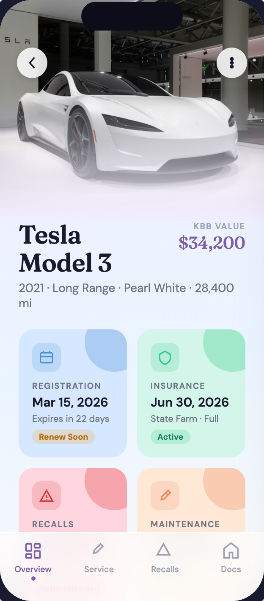
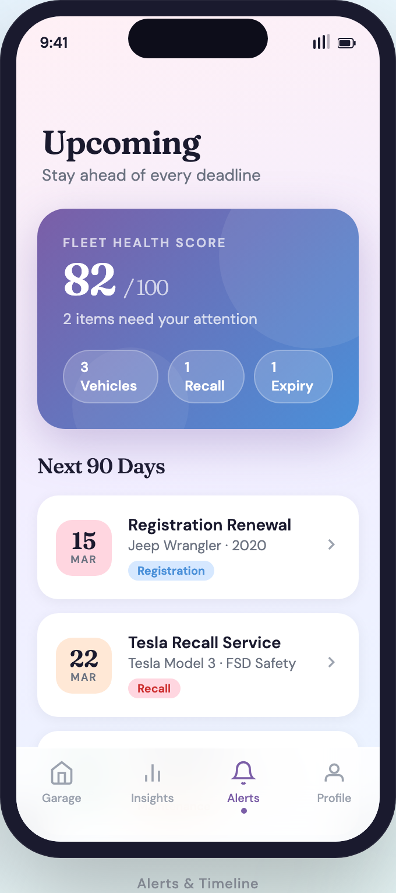
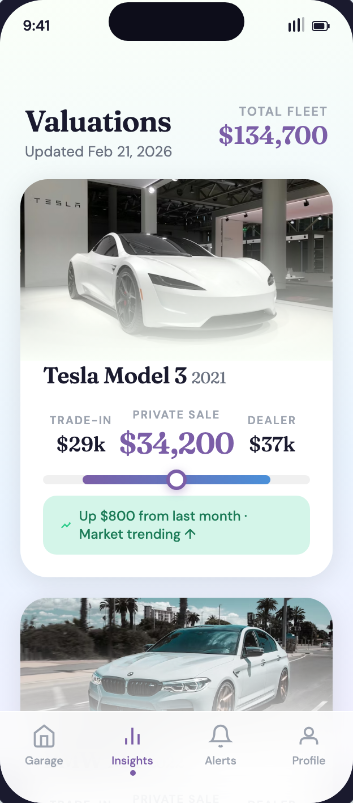

<p align="center">
  
</p>

<h1 align="center">Fleet</h1>

<p align="center">
  <strong>Your garage, beautifully organized.</strong>
</p>

<p align="center">
  
  
  
  
</p>

<br />

<p align="center">
  
</p>

<br />

Fleet is an iOS app for car owners who want a single, beautiful place to manage everything about their vehicles — registrations, insurance, NHTSA recalls, service history, and live KBB valuations.

Built with SwiftUI and designed around a soft pastel aesthetic with glass-morphism cards and fluid gradients.

---

## Screens

<p align="center">
  
  &nbsp;&nbsp;
  
  &nbsp;&nbsp;
  
  &nbsp;&nbsp;
  
</p>

<p align="center">
  <sub>Garage Home&nbsp;&nbsp;&nbsp;&nbsp;&nbsp;&nbsp;&nbsp;&nbsp;&nbsp;&nbsp;&nbsp;&nbsp;&nbsp;&nbsp;&nbsp;&nbsp;&nbsp;&nbsp;&nbsp;&nbsp;&nbsp;&nbsp;&nbsp;&nbsp;&nbsp;&nbsp;&nbsp;&nbsp;&nbsp;&nbsp;Car Detail&nbsp;&nbsp;&nbsp;&nbsp;&nbsp;&nbsp;&nbsp;&nbsp;&nbsp;&nbsp;&nbsp;&nbsp;&nbsp;&nbsp;&nbsp;&nbsp;&nbsp;&nbsp;&nbsp;&nbsp;&nbsp;&nbsp;&nbsp;&nbsp;&nbsp;&nbsp;&nbsp;&nbsp;Alerts & Timeline&nbsp;&nbsp;&nbsp;&nbsp;&nbsp;&nbsp;&nbsp;&nbsp;&nbsp;&nbsp;&nbsp;&nbsp;&nbsp;&nbsp;&nbsp;&nbsp;&nbsp;&nbsp;&nbsp;&nbsp;&nbsp;&nbsp;KBB Valuations</sub>
</p>

**Additional screens:** Login (Google Sign-In + demo mode) · Profile & Settings · Add Vehicle (VIN scan + manual entry)

---

## Features

<table>
  <tr>
    <td width="60" align="center">🏎️</td>
    <td><strong>Multi-Vehicle Garage</strong><br/>Track every car you own with high-res photos and at-a-glance status badges.</td>
  </tr>
  <tr>
    <td align="center">📋</td>
    <td><strong>Smart Reminders</strong><br/>Never miss a registration, insurance renewal, or maintenance window.</td>
  </tr>
  <tr>
    <td align="center">⚠️</td>
    <td><strong>Recall Alerts</strong><br/>Instant NHTSA recall notifications tied directly to your VIN.</td>
  </tr>
  <tr>
    <td align="center">💰</td>
    <td><strong>Live KBB Valuation</strong><br/>Real-time trade-in, private sale, and dealer estimates updated monthly.</td>
  </tr>
  <tr>
    <td align="center">💚</td>
    <td><strong>Fleet Health Score</strong><br/>A single 0–100 score that tells you how on-top-of-things you are.</td>
  </tr>
  <tr>
    <td align="center">🔐</td>
    <td><strong>Google Sign-In</strong><br/>Secure authentication — no passwords to remember.</td>
  </tr>
</table>

---

## Getting Started

### Prerequisites

| Tool | Version |
|------|---------|
| Xcode | 15.0+ |
| iOS Deployment Target | 17.0+ |
| [XcodeGen](https://github.com/yonaskolb/XcodeGen) | Latest |

### Quick Start

```bash
git clone https://github.com/iamadawra/fleet.git
cd fleet
brew install xcodegen    # if not already installed
xcodegen generate
open Fleet.xcodeproj
```

Build and run on a simulator or device. The app ships with sample data (Tesla Model 3, BMW M4, Jeep Wrangler) so you can explore every screen immediately.

> Tap **Skip for now** on the login screen to bypass Google Sign-In during development.

### Google Sign-In Setup

To enable real authentication:

1. Create a project in [Google Cloud Console](https://console.cloud.google.com)
2. Enable the Google Sign-In API and create an OAuth 2.0 client ID for iOS
3. Replace `PLACEHOLDER-REVERSED-CLIENT-ID` in `Fleet/Resources/Info.plist`
4. Add your `GoogleService-Info.plist` to `Fleet/Resources/`

---

## Architecture

```
Fleet/
├── Sources/
│   ├── App/                  FleetApp entry point
│   ├── Models/               Vehicle, Registration, Insurance, Recall,
│   │                         Maintenance, Valuation, FleetEvent, User
│   ├── Views/
│   │   ├── Auth/             LoginView
│   │   ├── Garage/           GarageHomeView, VehicleCardView, AddVehicleView
│   │   ├── Detail/           CarDetailView, StatusCardView
│   │   ├── Alerts/           AlertsView, EventCardView
│   │   ├── Valuations/       ValuationsView, ValuationCardView
│   │   └── Profile/          ProfileView
│   ├── ViewModels/           GarageViewModel
│   ├── Services/             AuthenticationService, SampleData
│   └── Theme/                FleetTheme (colors, gradients, constants)
└── Resources/
    ├── Assets.xcassets/      App icon, accent color
    └── Info.plist             URL schemes, launch screen config
```

**Design system:** Pastel palette (lavender, mint, peach, rose, sky) with accent purple `#7B5EA7`, accent blue `#4A90D9`, and accent green `#2ECC8B`. Cards use 22 pt corner radii, soft shadows, and glass-morphism backgrounds.

---

## Tech Stack

| Layer | Technology |
|-------|-----------|
| UI | SwiftUI |
| Auth | [Google Sign-In for iOS](https://github.com/google/GoogleSignIn-iOS) 8.0+ |
| Dependencies | Swift Package Manager |
| Project Gen | [XcodeGen](https://github.com/yonaskolb/XcodeGen) |
| Min Target | iOS 17.0 |

---

## License

This project is licensed under the MIT License. See [LICENSE](LICENSE) for details.
